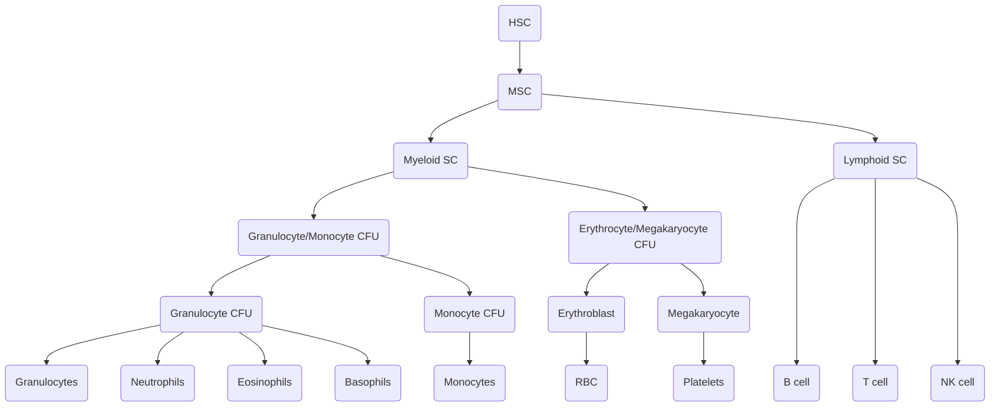

# Hematopoesis Basics

## Hematopoetic Stem Cell
- Identified by [**CD34**](Pathology/Misc/CDAssiciations)
- Pluripotent cell
- Hematopoesis starts at fetal life
	- At 3 weeks HSC is present in 
		- Yolk Sac
		- Mesoderm
			- Aorta
			- Gonads
			- Mesonephros
	- At 3 months
		- Liver
		- Spleen
		- Lymph Nodes
	- At birth
		- Bone Marrow of all bones
	- At puberty
		- Bone marrow of axial skeleton
		- Bone marrow at ends of long bones

## Hematopoesis

### Myeloid SC
- Aka trilineage SC
- 20$\mu$ in size
- 3-4 nucleoli
- Granular cytoplasm
### Lymphoid SC
- 20$\mu$ in size
- 0-2 nucleoli
- Condensed nucleus
- Non-granular cytoplasm

## Growth promoters
| Cell      | Intrinsic GF  | Drug         |
| --------- | ------------- | ------------ |
| RBC       | Erythropoetin | Darbopoietin |
| Platelets | IL-11         | Oprelvekin   |
| GM-CFU    | GM-CSF        | Sargramostim |
| G-CFU     | G-CSF         | Filgrastim   |

## Bone Marrow Examination
### Bone Marrow Aspiration
- To study 
	- Cell morphology
	- Enumeration
- Needles
	- Klima's Needle
		
	- Salah's Needle
		
- Size of needle  $\rightarrow$ 14 to 18gague
- Volume of sample  $\rightarrow$ 0.2 to mL
- Anticoagulant used  $\rightarrow$ EDTA
	- Prevents clotting 
	- Does not alter morphology
### Bone Marrow Biopsy
- To study
	- Cellularity
	- Fibrosis
	- Infiltrative disorders
- Needles
	- Jamshedi Needle (Trephine)
		
- Ideal site
	- Adults  $\rightarrow$ PSIS
	- Obese adult  $\rightarrow$ ASIS
	- Child  $\rightarrow$ Anterio end of tibia
- MC S/E  $\rightarrow$ Local site soreness
- BM exam can be done in individuals having low platelet count or mild clotting factor deficiency
- Pancytoenia seen in 
	- Aplastic Anemia
	- In conditions where damage to HSC
- Myeloproliferative Disorders
	- $\uparrow$ RBC
	- $\uparrow$ Platelets
	- $\uparrow$ WBC