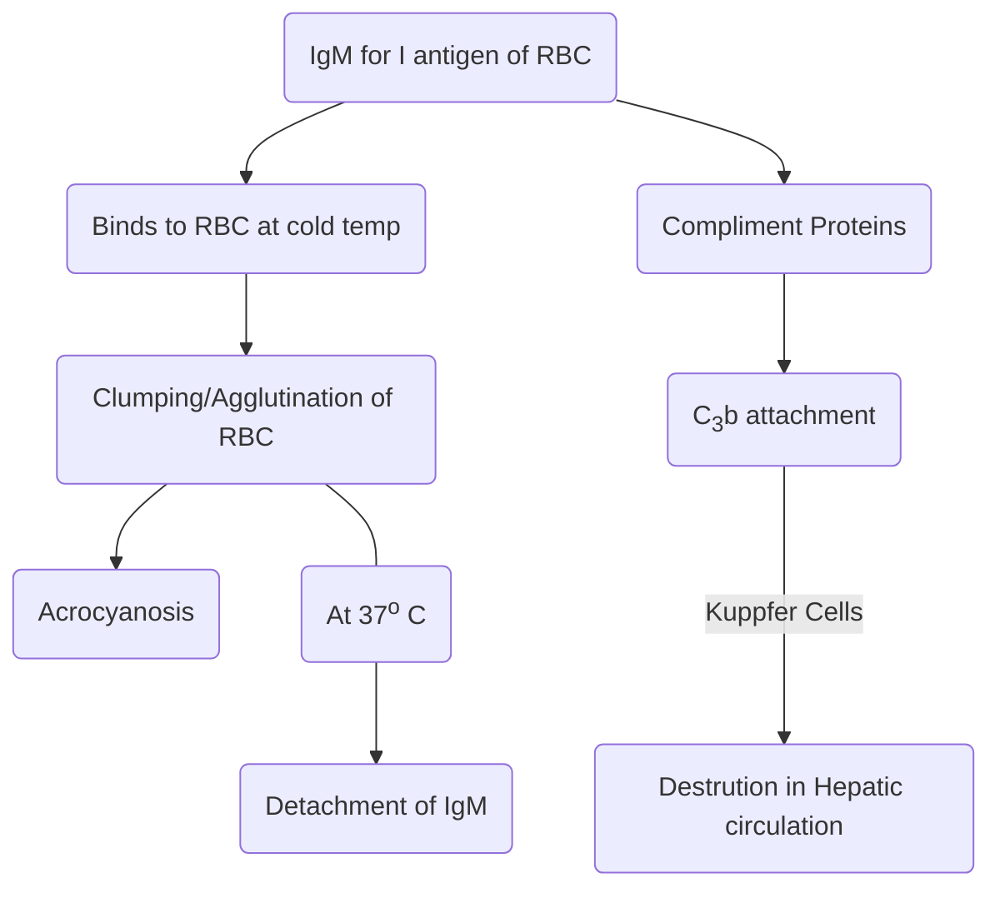
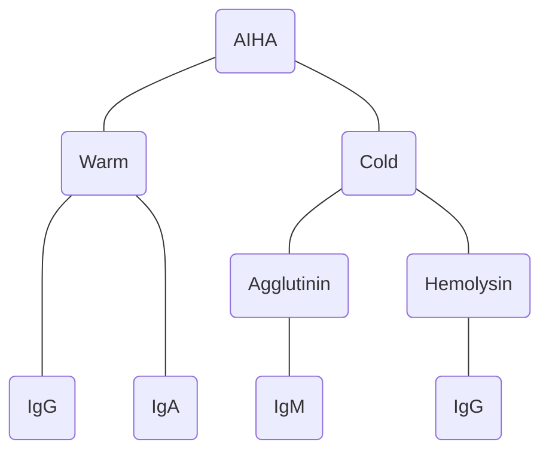

# Autoimmune Hemolytic Anemia

## General

- It is of 2 types
	- Warm AIHA 
		- Ab attach at 37o C
		- IgG >>> IgA
	- Cold AIHA
		- Ab attach at lower temperature
		- IgM >>> IgG
## Warm AIHA

### Causes

- Idiopathic
- Auto-immune disorders
	- SLE
	- RA
- Malignancies
	- CLL
- Drugs
	- $\alpha$-methyldopa
	- Penicillin
	- Quinidine
### Clinical Features
- Jaundice
- Anemia
- Splenomegaly
- Spherocyte in PBS

### Diagnosis
- $\uparrow$ LDH
- $\uparrow$ Unconjugated Bil.
- $\downarrow$ Hb
- Blood
	- PBS  $\rightarrow$ Spherocytes
	- Presence of autoantibodies
		- On RBC surface  $\rightarrow$ Direct Coomb's Test
		- Serum  $\rightarrow$ Indirect Coomb's Test

## Cold AIHA

### Types
- Cold Agglutinin Disease
- Cold Hemolysin

### Cold Agglutinin

#### Clinical Features
- Jaundice
- Anemia
- Acrocyanosis at low temp
- Hepatomegaly

#### Associations with Cold Agglutination Dieases (IgM)

- **Mycoplasma infections**
- **Malignancies**
- Infectious mononucleosis
- **Waldenstrom macroglobulinemia**

#### Diagnosis
- Cold slide test
	

### Cold Hemolysin Type

- Formation if **IgG against P antigen** of RBC
- Binds at 4o C  $\rightarrow$ Compliment Activation at 37o C  $\rightarrow$ MAC formation  $\rightarrow$ **Intravascular hemolysis**  $\rightarrow$ Hemoglobinuria
- Also called *Paroxysmal Cold Hemoglobinura*
- Cold Hemolysin  $\rightarrow$ **Donath Landsteiner Ab**
- Can be seen with
	- Viral Infections in Children
	- Syphylis

## Summary

- Warm
	- IgG/IgA
	- Causes
		- Idiopathic
		- Drugs
		- SLE
		- RA
	- RBC destruction at **Spleen**
- Cold
	- Agglutinin
		- IgM
		- RBC destruction at **Liver**
		- Ab attachment at lower temp
		- Extravascular Hemolysis
	- Hemolysin
		- IgG
		- Biphasic Ab
			- Attachment at 4o C
			- Compliment activation at 37o C
		- Intravascular hemolysis