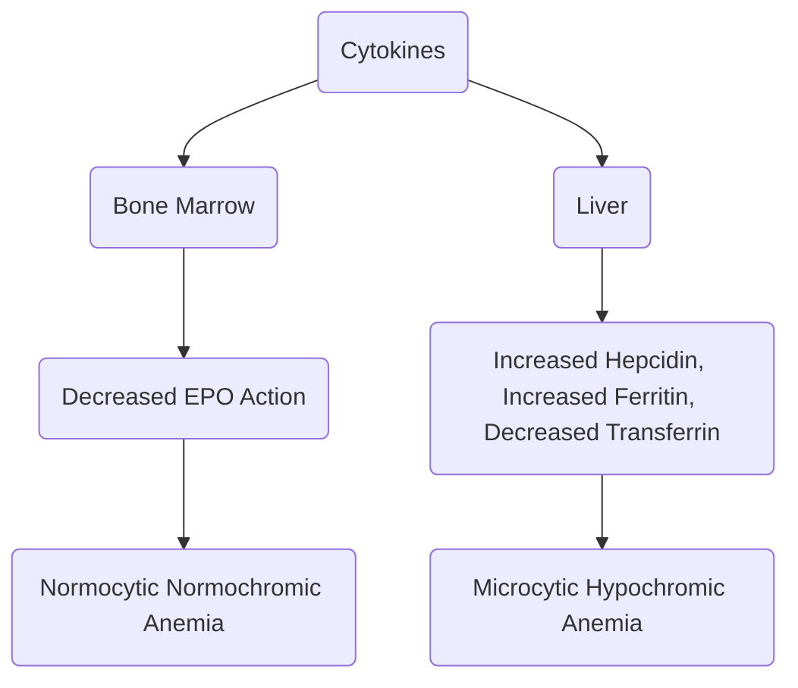
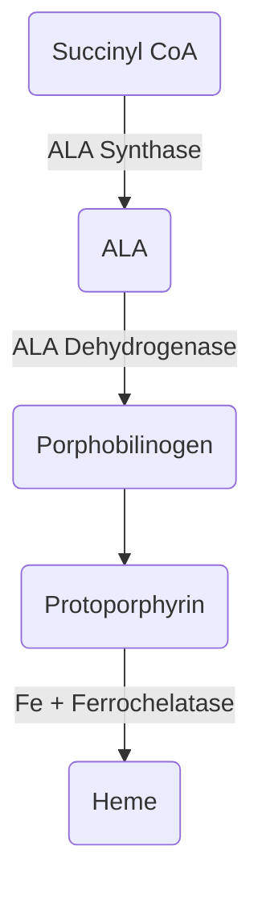

# Microcytic Anemia

## Iron Deficiency Anemia
### General
- MC cause of microcytic anemia
- Revise [Normal Iron Studies](Pathology/Hematology/RBC/HematParams.md#Iron%20Studies)
- Stain for Hemosiderin  $\rightarrow$ Prussian Blue
- Absorption  $\rightarrow$ Cheif site is duodenum
- Pure vegitarians have $\uparrow$ chances of Iron Deficiency
- Iron Metabolism
	 

### Causes of Iron Deficiency
- $\downarrow$ Intake
- $\downarrow$ Absorption  $\rightarrow$ Malabsorption, Diarrhoea
- $\uparrow$ Requirement
	- Growing Children
	- Reproductive age group
	- Pregnancy
	- Lactation
	- Blood Loss
	- Accidents / Trauma
	- Hook worm infestation
	- Peptic ulcer disease
	- Colon cancer
### Stages of Iron Deficiency
1. Iron storage deficiency
	- $\downarrow$ BM iron
	- $\downarrow$ Serum Ferritin
2. Iron Deficient Erythropoesis
	- $\downarrow$ S. Ferritin
	- $\downarrow$ S. iron
	- $\downarrow$ transferrin saturation
	- $\uparrow$ TIBC
3. Iron deficiency anemia
	- All of the above
	- RBCs affected
		- **Microcytic Hypochromic Anemia**
		- Anisocytosis
		- Poikilocytosis
			- Pencil cell
			- Target cell
			- Enhanced central pallor
### Clinical Features
- Fatigue
- Stunted growth
- Koilonychia

### Diagnosis
- BM Exam
	- Gold standard
	- $\downarrow$ $\downarrow$ Staining in Prussion blue
- Blood
	- $\downarrow$ Hb
	- $\downarrow$ MCH/MCV/MCHC
- Iron Profile
	- $\downarrow$ S. Ferritin
	- $\downarrow$ S. Iron
	- $\downarrow$ TF saturation
	- $\uparrow$ TIBC
- $\uparrow$ $\uparrow$ $\uparrow$ Free Erythrocyte Protoporphyrin

### Treatment
- Tream 1o cause
- Iron supplementation - Oral/Parenteral
	- Improvements can be seen in clinical symptoms as early as 3 to 4 days of initiation of iron supplementation
	- Iron supplementation is associated with **Brisk Erythropoesis**
## Anemia of Chronic Disease

### General
- Risk Factors
	- Chronic TB infection
	- Chronic Inflamattion  $\rightarrow$ RA
		- Mediated by
			- IL-6
			- IL-1
			- TNF-$\alpha$
	- Cancer
- Normocytic normochromic anemia > Microcytic hypochromic anemia
- **Hepcidin**  $\rightarrow$ Inhibits iron metabolism
- Disease process

### Diagnosis
- Iron Studies
	- $\uparrow$ S. Ferritin
	- $\downarrow$ Transferrin saturation
	- $\downarrow$ S. Iron
	- $\downarrow$ TIBC
- Transferrin-log(ferritin) ratio = $\frac{S.Transferritin}{\log{Ferritin}}$
	- < 1.5  $\rightarrow$ Anemia of Chronic Disease
	- > 1.5  $\rightarrow$ Iron deficiency Anemia

### Treatment
- Does not respond to Iron supplementation
- Treat 1o cause
- In cancer patients  $\rightarrow$ Erythropoetin

## Sideroblastic Anemia
### Heme Metabolism

### Causes
- Congenital  $\rightarrow$ Enzyme defects
- Acquires (MC)
	- B6 deficiency
		- Primary
		- Isoniazid
		- Dietary
	- Alcohol (MC)
	- [LeadPoisoning](Forensic/Toxicology/LeadPoisoning.md)
		- Damages ALAD and Ferrochelatase
	- Copper deficiency
### Diagnosis
- Fe  $\rightarrow$ damage to RBC precursor  $\rightarrow$ Leakage of Iron  $\rightarrow$ Iron Overload
- On BM Exam  $\rightarrow$ **Ringed Sideroblasts**
		
	- Ringed sideroblasts seen in
		- Sideroblastic Anemia
		- Myelodysplastic Syndrome
		- [Thalassemia](Pathology/Hematology/RBC/Thalassemia.md)
		- [Megaloblastic Anemia](Pathology/Hematology/RBC/MegaloblasticAnemia.md)
		- [Hemolytic Anemias](Pathology/Hematology/RBC/HemolyticAnemiaBasics.md)
- Iron Profile
	- $\uparrow$ S. Ferritin
	- $\uparrow$ S. Iron
	- $\uparrow$ TF Saturation
	- $\downarrow$ TIBC

## Iron Studies in All Microcytic Hypochromic Anemias

| Disease                 |          IDA          |     AOCD     | Thalassemia |
| ----------------------- | :-------------------: | :----------: | :---------: |
| S. Ferritin             |     $\downarrow$      |  $\uparrow$  |      N      |
| S. Iron                 |     $\downarrow$      | $\downarrow$ |      N      |
| Transferring saturation |     $\downarrow$      | $\downarrow$ |      N      |
| TIBC                    | $\uparrow$ $\uparrow$ | $\downarrow$ |      N      |
