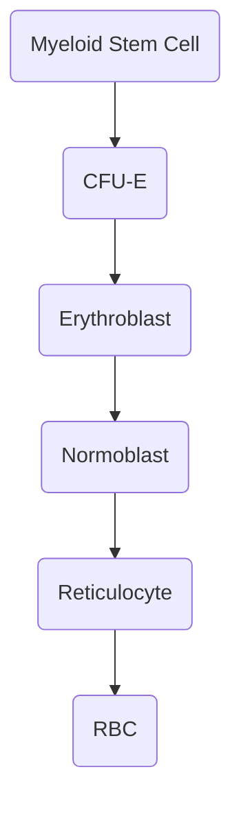

# RBC Development

## Basic Development
### Stages

- From top to bottom
	- $\uparrow$ Differentiation
	- $\downarrow$ Size
	- $\downarrow$ Size of Nucleus
	- $\uparrow$ Hb Concentration
- Hb first detected in Early Normoblast on Electron Microscope

### Normoblast
- Early
	- Has bluish cytoplasm so called as Basophilic Normoblast
- Intermediate
	- Polychromatophilic normoblast  $\rightarrow$ Hb detected on Light Microscope
- Late 
	- Orthochromatophilic Normoblast

### Erythropoetin
- Required for the normal development of RBC
- Predominant source  $\rightarrow$ Kidney (Peritubular capillary cells) > Liver
- **t\frac{1}{2} = 6 to 9 hrs**
- maximum receptors of erythropoetin is present on **CFU-E**

### Erythroferrone
- Secreted by normoblast
- Increases absorption of iron in body by **reducing Hepcidin**

## Reticulocyte
- First non-nucleated cell in RBC development
- Detection requires supra-vital staining
	- Stains
		- New methylene blue
			- Preferred/best stain
		- Brilliant cresyl blue
	- Mesh like appearance
		
- Normal  $\rightarrow$ 1-2%
- Time for maturation  $\rightarrow$ 1 day
- Absolute retic. count  $\rightarrow$ No. of reticulocytes in 1mm3 blood
- Corrected reticulocyte count  $\rightarrow$ $\frac{Retic. Count \times Hb[patient]}{Hb[normal]}$
- Used to estimate compensatory increase of reticulocytes in certain conditions
- In very severe anemia _Reticulocyte production Index_ must be calculated
	- Reticulocyte production index  $\rightarrow$ $\frac{Corrected-Retic.-Count}{Maturation-time-correction}$

| HCT | Correction Factor |
| --- | ----------------- |
| 45  | 1                 |
| 35  | 1.5               |
| 25  | 2.0               |
| 15  | 2.5               |
- Reticulocyte count gives estimation of Bone marrow activity  $\rightarrow$ **Poor man's BM Aspiration**
- RPI < 2.5 indicates  $\rightarrow$ $\downarrow$ proliferation / $\downarrow$ maturation
- RPI > 2.5 indicates  $\rightarrow$ Hemolytic anemia
- $\uparrow$ Retic count
	- Hemolytic Anemia
	- Fe/FA/B12 supplementation
- $\downarrow$ Retic count
	- Aplastic Anemia
	- Deficiency of Fe/FA/B12
	- Leukemias/[Metastatis](Surgery/Skeletal/Bone/BoneMets)
	- Myelofibrosis

## RBCs
- Normal size  $\rightarrow$ 7-8$\mu$
- Biconcave shape
- More Hb at periphery than center
- Shape and flexibility maintained by
	- Spectrin  $\rightarrow$ most imp
	- Band proteins
	- Ankyrin
#### Parameters
| Parameter |   Value   |
| :-------: | :-------: |
|    MCH    |  27-33pg  |
|    MCV    | 80-100 fL |
|   MCHC    | 33-36g/dL |
- MCV = $\frac{Hematocrit \times 10}{RBC-count}$
- MCHC = $\frac{MCH}{MCV}$
- [Heriditary Spherocytosis](Pathology/Hematology/RBC/HeriditarySpherocytosis.md)  $\rightarrow$ MCHC is higher
- Poikilocytosis  $\rightarrow$ Change in shape of RBCs
- Anisocytosis  $\rightarrow$ Change in size of RBCs
- Parameter to check anisocytosis  $\rightarrow$ RDW
	- Normal  $\rightarrow$ 11.5 - 14.5
- B12 deficiency / Megaloblastic Anemia  $\rightarrow$ MCHC is normal

