# Thalassemia

## General
- **Quantitative** disorder of Hb
- Hb is made of
	- 2$\alpha$  chains 
		- 4$\alpha$ genes on **Chr16**  $\rightarrow$ HBA1 and HBA2
	- 2$\beta$ chains
		- 2$\beta$ genes on **Chr11**  $\rightarrow$ HbB gene
- $\alpha$-Thalassemia  $\rightarrow$ due to **gene deletion**
- $\beta$-Thalassemia  $\rightarrow$ due to **gene mutation** (MC)

## $\beta$-Thalassemia

### General
- Normal Adult  
	- HbA ($\alpha$2$\beta$2)  $\rightarrow$ 95%
	- HbF ($\alpha$2$\gamma$2)  $\rightarrow$ 1%
	- HbA2 ($\alpha$2$\alpha$2)  $\rightarrow$ 3%
- $\beta$ gene isoforms
	- $\beta$  $\rightarrow$ Normal $\beta$ chain formulation
	- $\beta$+  $\rightarrow$ Partial $\beta$ chain formulation
	- $\beta$o  $\rightarrow$ No $\beta$ chain formulation
-  Classification of the mutations in Thalassemia
	- Splicing mutations  $\rightarrow$ $\beta$+ >>> $\beta$o
	- Promoter mutations  $\rightarrow$ $\beta$+
	- Chain Termination mutations  $\rightarrow$ $\beta$o
- MC mutation in thalassemia is **Nonsense mutations** (mutation leading to stop codon)
- MC mutation involved in partial synthesis of $\beta$ chain  $\rightarrow$ **Splicing mutation**
- MC mutation in India  $\rightarrow$ **IVS-1-5 (G $\rightarrow$ C)**
- Other mutations
	- 619 bp deletion
	- IVS-1 (G  $\rightarrow$ T)
	- Codon 41/42 frameshift mutation
	- Codon 8/9 frameshift mutation

### Clinical Possibilities
- $\beta$/$\beta$  $\rightarrow$ Normal  $\rightarrow$ Hb = 14-17g/dL
- $\beta$/$\beta$+ or $\beta$/$\beta$o  $\rightarrow$ Thalassemia Minor / Thalassemia trait
	- Mild
	- Hb > 10g/dL
	- Asymptomatic
	- No H/o blood trasfusions
- $\beta$+/$\beta$+  $\rightarrow$ Thalassemia Intermedia
	- Moderate
	- Hb  $\rightarrow$ 8-9g/dL
	- On and off transfusions
- $\beta$o/$\beta$o or $\beta$o/$\beta$+ or $\beta$+/$\beta$+  $\rightarrow$ Thalassemia Major (Cooley's Anemia)
	- Severe
	- Hb  $\rightarrow$ <7g/dL
	- Regular blood transfusions
	- **Transfusion dependant** thalassemia

### Thalassemia Major
#### Pathological Cascade

```mermaid
graph TD
n1(Relative excess of 𝛼 chains)
n2(𝛼 chain precipitation)

na1(In bone marrow, direct damage to normoblast)
na2(Ineffective erythropoesis)

nb1(Escape in circulation)
nb2(Trapped in spleen)
nb3(Extra Vascular Hemolytic Anemia)

n3(SEVERE ANEMIA)

n4(Increased EPO)
n5(Extramedullary hematopoesis)
n6(Liver Spleen Bones)
n6.1(Hepatosplenomegaly)
n6.2(Bony involvement)
n6.2.1(Facial bones involved)
n6.2.2(Skull bones involved)

n6.2.1.1(Malocclusion of Teeth)
n6.2.2.1(Frontal Bossing)

n6.3(CHIPMUNK FACIES)

n1 --> n2

n2 --> na1
na1 --> na2
na2 --> n3

n2 --> nb1
nb1 --> nb2
nb2 --> nb3
nb3 --> n3

n3 --> n4
n4 --> n5
n5 --> n6
n6 -----> n6.1
n6 --> n6.2

n6.2 --> n6.2.1
n6.2 --> n6.2.2

n6.2.1 --> n6.2.1.1
n6.2.2 --> n6.2.2.1

n6.2.1.1 --> n6.3
n6.2.2.1 --> n6.3
```

#### Repeated Blood transfusion complications

- Regular blood transfusions  $\rightarrow$ Iron  $\rightarrow$ Iron Overload
- Release of **Erythroferrone**
	- $\uparrow$ Bone marrow activity  $\rightarrow$ $\uparrow$ Erythroid precursors  $\rightarrow$ Erythroferrone  $\rightarrow$ $\downarrow$ Hepcidin  $\rightarrow$ Iron overload
- Iron is involved in generation of free radicals  $\rightarrow$ _Fenton's Reaction_
- Iron overload  $\rightarrow$ 2o Hemochromatosis
	- Iron deposition in
		- Heart
			- Cardiac Failure  $\rightarrow$ Death
		- Pituitary
			- Endocrine Failure  $\rightarrow$ Death
		- Pancreas
			- Bronze Diabetes
		- Liver
			- Cirrhosis
		- Parathyroid

#### Diagnosis

- Blood
	- $\downarrow$ Hb
	- $\downarrow$ MCV
- Peripheral Smear
	- Microcytic hypochromic
	- Anisocytosis
	- Poikilocytosis
	- Target Cells (Differentiating feature from IDA)
	- Basophilic stippling (due to abnormal ribosomes)
	- Howell Jolly Bodies (DNA Remnants)
	- Nucleated RBCs
		
- $\downarrow$ $\downarrow$ Osmotic Fragility
- Hb HPLC (2nd best) > Hb Electrophoresis  $\rightarrow$ Protein detection
- **Globin Sequencing**  $\rightarrow$ Best  $\rightarrow$ Definitive Diagnosis
	- Expensive and usually unavailable
	- Superior over protein detection because
		- Can detect Thalassemia in presence of coexisting Hemoglobinopathies
		- Result not interfered with recent blood transfusion
- Radiodiagnosis
	- Crew cut/Hair on end appearance of skull
		
#### Treatment
- Regular blood transfusions  $\rightarrow$ Packed RBCs
- Control Iron overload  $\rightarrow$ Iron chelators
- **Allogenic Bone Marrow Transplant**  $\rightarrow$ TOC

### Thalassemia Trait / Minor

#### General
- $\downarrow$ Intesity
- Mild Anemia
- No H/O Blood transfusion
- Peripheral smear  $\rightarrow$ Mild+

#### Diagnosis
- NESTROF  $\rightarrow$ Screening
	- Naked Eye Single Tube Red cell Osmotic Fragility Test
	- $\downarrow$ Osmotic Fragility
	- Procedure
		- Mix Hypotonic saline (5mL) with 0.2mL blood
		- Wait for 30 minutes
		- Check visibility of black line
		- **Black line** is **not visible**  $\rightarrow$ _Positive_
		
- Diagnosis confirmed by **Hb HPLC**
	- $\uparrow$ HbA2 > 3.5g/dL
#### Treatment
- No treatment is needed since they are asymptomatic

## $\alpha$-Thalassemia

### General
- Due to **gene deletion**
- Chr16  $\rightarrow$ 4$\alpha$ genes responsible for 2$\alpha$ chains

### Clinical Possibilities
- $\alpha$$\alpha$/$\alpha$$\alpha$  $\rightarrow$ Normal
- $\alpha$$\alpha$/$\alpha$o $\rightarrow$ Asymptomatic
	- Silent Carrier  $\rightarrow$ 75% $\alpha$ chains
- **$\alpha$ thalassemia trait**
	- $\alpha$o/$\alpha$o  $\rightarrow$ Mild
		- 50% $\alpha$ chains
		- Trans gene deletion
	- $\alpha$$\alpha$/oo  $\rightarrow$ Mild
		- Southeast Asians
		- 50% $\alpha$ chains
		- Cis $\alpha$ Thalassemia
		- Marriage not advised if partner is also carrier
- $\alpha$o/oo
	- 25% $\alpha$ chains  $\rightarrow$ $\beta$4 tetramer
	- High precipitation  $\rightarrow$ Golf ball appearance on _supravital staining_
	- High O2 affinity  $\rightarrow$ Tissue hypoxia
		
- oo/oo  $\rightarrow$ Fetal life
	- **$\gamma$4 teramer**  $\rightarrow$ Hb Barts  $\rightarrow$ High O2 affinity
	- IUD in 3rd trimester  $\rightarrow$ **Non-Hydrops fetalis**
	- The fetus survives 1st and 2nd trimester due to formation of $\xi\gamma$ Hb