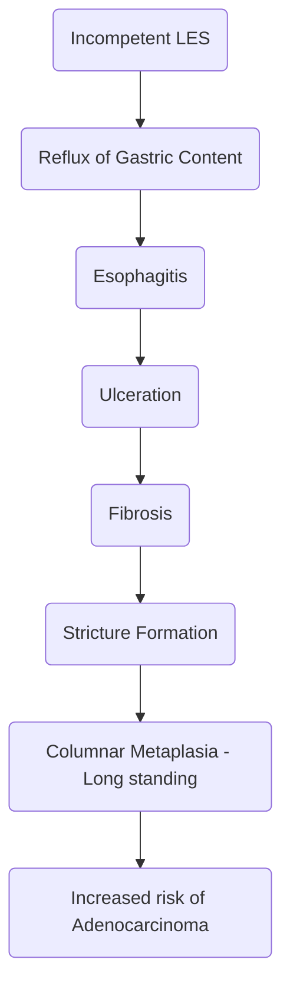

# Esophagus

## Anatomy
- Length - 25cm
- Extent - C6 - T11
- On endoscopy, 3 narrowings are seen from upper incisors

| Distance | Marker                        |
| :------- | ----------------------------- |
| 15cm     | Beginning + Cricopharynx      |
| 25cm     | Arch of aorta + Left Bronchus |
| 40cm     | Diaphragm                     |
- Lining epithelium of esophagus - Stratified squamous epithelium
- Muscular distribution
	- Upper $\frac{1}{3}$rd - Straiated muscle fibres
	- Lower $\frac{1}{3}$rd - Smooth muscle fibres
	- Middle $\frac{1}{3}$rd - Slow transition from striated to smooth muscles
- Characteristics
	- Lacks serosa
	- No villi
	- No secretions
	- No Meissner's Plexus
	- Only Auerbach's Plexus
- Unique feature - Presence of <u>Lymphatics</u>
- Other features
	- Narrowest tube in GIT
	- Narrowest part of esophagus - Cricopharynx 
		- Diameter 1.5cm
		- Any foreign body that can cross cricopharynx can cross other parts of GIT and excreted in stool
		- Exceptions (Requiring intervention)
			- Sharp bodies
			- Button batteries
		- On chest Xray:
		 

## Congenital Diaphragmatic Hernia
### General
- Protrusion of viscous / part of viscous through wall of it's containing cavity
### Types
#### Bochdalek Hernia
- MC type of CDH
- <u>Left sided posterolateral Hernia</u>
- Incidence - 1 in 2000 - 5000 live births
- Cause
	- Failure of fusion of <u>pleuro-peritoneal canal</u> at left side
- The left out space at the abdomen due to herniation causes the scaphoid abdomen
- MC organ herniated - Small Intestine > Stomach
- Dextrocardia
	- Since there is failure of fusion, left viscera (Spleen, Stomach and Transverse Colon) herniates and pushes heart to right
- Triad of CDH
	- Respiratory Distress
	- Dextrocardia
	- Scaphoid Abdomen
- Bag and mask ventilation <u>contraindicated</u>
	- Massive amount of air will collect in stomach causing further lung collapse
- Diagnosis
	- During pregnancy - Polyhydramnios
	- At delivery - On Chest X-ray
		- Presence of gastric bubble in thorax
		- Presence of bowel loops in thorax
		- Coiling of Ryle's tube in thorax
- Management
	- Principle of Treatment
		- Reduce herniated organs back into abdominal cavity
	- For large defects - Use prosthetic patch for closure (Mesh not used because children will grow)
	- If sac present - Excision done

#### Morgagni Hernia
- In between right side of xiphoid and central tendon of Diaphragm
	- Shape is called <u>Space of Larry</u>
	- Also called Larry's Hernia
	- Right sided retrosternal hernia
	- Normally suprior epigastric vessels pass through the space of Larry
- MC in right side
- MC organ herniated - Transverse colon
- Incidental finding
- Management
	- reduce herniated organs and close defect

#### Hiatus Hernia
##### General
- Acquired Hernia
- Common in adults
##### Types

|  Type   | Description                                                                                                                                                            |
| :-----: | ---------------------------------------------------------------------------------------------------------------------------------------------------------------------- |
|   I  | <ul><li>Sliding Hernia (MC Type)<li>Herniation of GE Junction</ul>                                                                                                     |
|  II  | <ul><li>True paraesophageal hernia (Rolling hernia)<li>Herniation of fundus of stomach<li>GE junction located below diaphragm<li><u>MC type of paraesophageal hernia<u></ul> |
|  III | <ul><li>Mixed Paraesophageal Hernia (Sliding + Rolling)<li>Herniation of both GE junction and fundus of stomach</ul>                                                   |
|  IV  | <ul><li>Paraesophageal hernia<li>Content other than stomach</ul>                                                                                                       |

##### Signs and symptoms

| Type | Signs and Symptoms                                                                                                                                        |
| :--: | --------------------------------------------------------------------------------------------------------------------------------------------------------- |
|  I   | <ul><li>Reflux<li>Due to repeated up and down movement, there is formation of ulcer at lesser curvature known as <u>Riding Ulcer/Cameron's Ulcer</u></ul> |
|  II  | Herniation of fundus leading to ischemia which causes abdominal pain                                                                                      |
| III  | Reflux and abdominal pain                                                                                                                                 |
|  IV  | High risk of ischemia and strangulation (Abdominal pain + increased risk of complications)                                                                |

##### Investigations
- IOC for diagnosis - Barium Swallow

##### Treatment
- Laproscopic Hiatal Hernia repair via abdominal route

## Stress Ulcers
- Stress gastritis / Hemorrhagic gastritis
- Cushing ulcer - Due to head injury
- Curling ulcer - due to Burns (When > $\frac{1}{3}$rd Body surfae area is involved)
- MC site of stress ulcer in stomach
	1. Fundus
	2. Body
	3. Antrum
	4. Pylorus
- MC site of stress ulcer in duodenum
	1. 1st part
	2. 2nd part
	3. 3rd part
	4. 4th part
## Esophageal sphincters

|                        | Upper esophageal sphincter                                                                                                    | Lower esophageal sphincter                  |
| ---------------------- | ----------------------------------------------------------------------------------------------------------------------------- | ------------------------------------------- |
| <b>Normal Length</b>   | 4-5cm                                                                                                                         | 5cm                                         |
| <b>Normal Pressure</b> | 60 mmHg                                                                                                                       | 6-26 mmHg                                   |
| <b>Muscles</b>         | Has 3 muscles<ul><li>Distal portion of inferior constrictor<li>Cricopharyngeus<li>Circular muscles of proximal esophagus</ul> | Intrinsic smooth muscles of lower esophagus |
- Factors that decrease LES pressure
	- Drugs
		- Prostaglandin E1, E2
		- Progesterone
		- Theophylline
		- Barbiturates
		- Diazepam
		- Dopamine
		- CCBs
		- Atropine
		- Nitrates
	- Foods
		- Chocolate
		- Coffee
		- Alcohol
		- Peppermint
		- Smoking
		- Fatty Food
- Incompetent LES
	- Total length < 2cm
	- Intra-abdominal length of LES < 1 cm
	- LES pressure < 6mmHg
	- Leads to GERD
### Upper Esophageal Sphincter

- It is composed of oblique fibres of <u>thyropharyngeus</u> and transverse fibres of <u>cricopharyngeus</u> muscles
- Dehiscence between the fibres of **thyropharyngeus and cricopharyngeus** muscles - <u>Kilian's dehiscence</u>
- Dehiscence below **cricopharyngeus** - <u>Laimer's dehiscence</u>
- Area **below and laterally to cricopharyngeus** - <u>Killian-Jamieson's area</u>
- Esophageal diverticula
	- Herniation in Killian's dehiscence  $\rightarrow$ Zenker's diverticulum
	- Herniation in Killian-Jamieson's area  $\rightarrow$ Killian-Jamieson's diverticulum
- Other esophageal diverticula
	- Mid-esophageal / Traction diverticulum **(Only true diverticulum of esophagus)**
	- Epiphrenic diverticulum (located above diaphragm)
	
#### Zenker's Diverticulum
##### General
- MC type of esophageal diverticulum
- It is a false diverticulum (mucosa and submucosa)
- MC in elderly/diabetic/males
- Inferior constrictor muscle has dual nerve supply
	- Supplies
		- Thyropharyngeus - supplied by pharyngeal plexus
		- Cricopharyngeus - supplied by RLN
	- Due to dual nerve supply - Neuromuscular incordination during swallowing leads to herniation through Killian's dehiscence due to increased pressure.
	
##### Symptoms
- MC - Dysphagia
- 50% cases - Zenker's diverticula is associated with cervical web
- Halitosis
- Regurgitation
##### Complications
- MC complication - Lung abscess
- Increased risk of SCC (due to chronic inflammation of Zenker's diverticula)
##### Investigation
- IOC - Barium Swallow
	
##### Treatment
- TOC - Cripharyngeal myotomy + Diverticulopexy
- Other alternative procedures
	- Diverticulectomy (for larger diverticula > 4cm)
	- Dohlman's procedure
		- Diverticulo-esophagostomy
		- It is endoscopic stapling of septum located between esophagus and diverticula

## GERD
### General
- Incompetent LES leads to GERD
- Sequence of events

### Clinical Features
- Classical Triad of
	- Retrosternal heartburn
	- Epigastric Pain
	- Regurgitation
- MC presentation - H/o long standing heartburn with shorter h/o regurgitation

### Diagnosis
- IOC - 24 hours ambulatory pH monitoring and <u>Demeester's</u> score is calculated
	- Normal < 14.7
	- GERD > 14.7
### Management
- Lifestyle modifications
	- Cessation of smoking
	- Decrease caffeine intake
	- Avoid large meals just before lying down
- For symptomatic improvement
	- Double dose PPI
- TOC: Surgery
- Before surgery following investigations are mandatory
	- 24 hrs ambulatory pH monitoring
	- Barium swallow (rule out sliding hernia)
	- Endoscopy with biopsy (rule out Barret's Esophagus)
- Gold standard treatment of GERD - Laproscopic Nissen fundoplication 360o
### Fundoplication
- Watson fundoplication
	- Fundus of stomach taken to cover only 90o of esophagus anteriorly
	- Rarely performed
	
- DOR fundoplication
	- Fundus of stomach is taken to cover 180o of esophagus anteriorly
	- MC performed partial fundoplication
	
- Toupet fundoplication
	- Fundus of stomach is taken to 270o of esophagus posteriorly
	- MC performed partial fundoplication
	
- Belsey Mark IV
	- Fundus of stomach is taken to cover 270o of esophagus anteriorly
	- Rarely performed
- Nissen's 360o fundolication
	- MC performed
	- One part of fundus is taken behind the esophagus and other part of fundus is taken in front of esophagus
	- Both of them are plicated in front of esophagus
	
