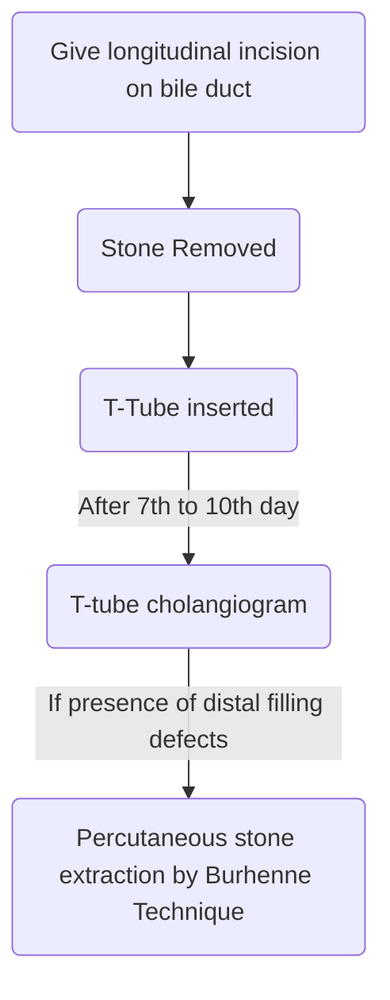
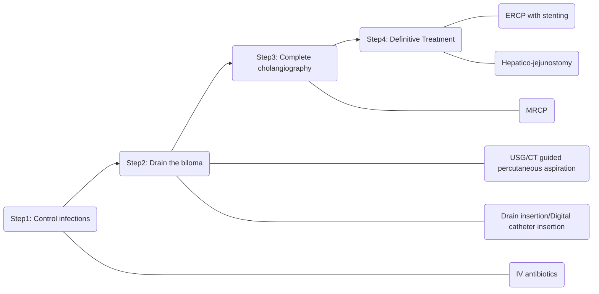

# Bile Duct
## Anatomy
- Common Hepatic Duct
	- Length →  1-4cm
	- Diameter →  4mm
- Common bile duct
	- Length → 1 - 4 cm
	- Diameter → 5-10mm
- Blood supply
	- Has coaxial blood supply
		- Blood supply is present at 3o' clock and 9o' clock position
		- Hence longitudinal incision is given in bile duct
	- Supraduaodenal bile duct gets blood supply from:
		- Inferior (60%)
			- Pancreatic duodenal artery
			- Retro duodenal artery
		- Superior (38%)
			- Right hepatic artery
			- Cystic duct artery
- Sphincter of Oddi complex
	1. Superior choledochal sphincter
	2. Inferior choldocal sphncter
	3. Sphincter ampulaae
	4. Sphincter pancreaticus
	![[SphincterofOddi.jpg]]
## Choledochal Cyst
### General
- Dilatation of bile duct
- Congenital
- MC in Children
### Pathophysiology
- Most accepted hypothesis - **APBDJ** (Abnormal pancreatico biliary duct junction)
	- Has long common channel
	- Reflux of pancreatic enzyme
	- Digestion of bile duct wall
	- Wall dilation
### Classification
- Todani Modification of Alonso-lej Classification

| Type | Description                                                              |
| :--- | ------------------------------------------------------------------------ |
| Ia   | Cystic dilation of extra hepatic bile duct (MC)                          |
| Ib   | Focal segmental dilatation of extra hepatic bile duct                    |
| Ic   | Fusiform dilatation of extra hepatic bile duct                           |
| II   | Diverticular dilatation of extrahepatic bile duct                        |
| III  | Dilatation of intraduodenal part of bile duct (Choledococele)            |
| IVa  | Dilatation of both intra and extra hepatic bile ducts                    |
| IVb  | Multiple cysts involving only extra hepatic bile duct                    |
| V    | Multiple cysts involving only intra hepatic bile duct (Caroli's disease) |
![[CholedochalCyst.jpg]]
- Type I - MC in 
	- Choledochal cyst
	- Hiatus hernia
	- Gastric ulcer
	- Fistula in Ano
	- Posterior urthral valve
- MC type of choledochal cyct → Type I > IV > III
- Type IV - cystic dilatation of cystic duct (not part of Todani classification)
### Treatment
- Type IVA and V → Liver transplantation
- Type I, II, IVb → Roux-en-Y Hepatico-jejunostomy
- Type III → Endoscopic sphincterotomy with cyst unroofing
### Clinical Features
- Mass + Pain + Jaundice (Intermittent jaundice)
- MC symptom in < 2 years of age → Jaundice
- MC symptom in > 2 years of age → Abdominal pain
- MC site of cholangiocarcinoma - Posterior wall of cyst
- Increased risk of organ malignancies
	- Liver
	- Gall Bladder
	- Bile Duct
	- Pancreas
	- Duodenum
### Investigation
- IOC - [MRCP](Misc#MRCP) (Magnetic Resonance Cholangiography)
- ERCP (Endoscopic Retrograde)
	- Diagnostic + Therapeutic
	- Side viewing endoscope used
	- After reaching ampullae using endoscope
		- Bile duct and pancreatic ducts are cannulated
		- Dye injected to detect stone or stenosis
	- Used to
		- Remove stone from <b><u>distal</b></u> part of bile duct
		- Put stent for <b><u>distal</u></b> biliary stricture
- PTC (Percutaneous Transhepatic Cholangiography)
	- Diagnostic + Therapeutic
	- Used to
		- Remove stone from <b><u>proximal</b></u> part of bile duct, intrahepatic bile
		- Locate stent for <b><u>proximal</b></u> biliary strictures
## Choledocolithiasis
### General
- Present in 6-12% patients of gall stones
- Types
	- Retained CBD stones
		- Detected within 2 years of cholecystectomy
	- Recurrent CBD stones
		- Detected after 2 years of cholecystectomy

| Primary stones                                                   | Secondary stones            |
| :--------------------------------------------------------------- | :-------------------------- |
| Formed inside CBD                                                | Formed in Gall Bladder      |
| MC stone - Brown                                                 | Slips into CBD              |
| MC in developing countries                                       | MC type - Cholesterol stone |
| Worm infestations<ul><li>_Ascaris_<li>_Clonorchis sinensis_</ul> | MC in western countries     |
### Lab Parameters
- ALP $\uparrow$ 
- GGT $\uparrow$
- 5-nucleotidase $\uparrow$
### Clinical Features
- Two types of presentation
	- Asymptomatic
		- Asymptomatic elevation of [[#Lab Parameters]]
	- Jaundice with or withot complications
### Complications
- Increased risk of infections
- Increased risk of pancreatitis
- Increased risk of cholangiocarcinoma
### Investigation
- Gold Standard - ERCP
- IOC - MRCP
### Treatment
- ERCP + Stone removal
	- Maximum size of stone removed - 1.5cm
- Stone > 1.5cm - Choledocotomy
- When distal obstruction is suspected - Choledochoduodenostomy
## Cholangitis
### General
- Mandatory principles
	- Obstruction
	- Infection
- Predisposing factors
	- Choledocholithiasis (MC)
	- Biliary stricture
	- Choledochal cyst
	- Cholangiocarcinoma
	- Worms
### Pathophysiology
- MC organism : _E. coli_ > _Klebsiella_
- Normal CBD pressure : 10 - 12cm of H2O
- When obstruction occurs → CBD pressure rises
- When CBD pressure > 25cm of H2O two reflexes occur
	- Cholangiovenous
	- Cholangiolymphatic
### Clinical Features
- **Charcot's Traid** : pain + Jaundice + Fever
- Reynold's Pentad (if delayed t/t) : Charcot's triad + Shock + Mental status changes
- >50% pts. have +ve blood culture
- MC symptom of of sepsis in cholangitis is Chills
### Management
- Two Large bore IV canula
- Start IV fluids + IV antibiotics
- If no improvement: ERCP with stone extraction/stenting
- If not available/failed : PTC with stone extraction/stenting
- If PTC not available/failed: Open biliary decompression
#### Open Biliary Decompression

## Autoimmune Disorders
### General
- Autoantiody - Anti-mitochondrial antibody
- MC in females

### Pathology
- Progressive destruction of intrahepatic bile ducts only
- Diagnostic appearance
	- Florid duct lesion with lymphocytic infiltration and granulomatous inflammation
- Associated with
	- Hyperlipidemia
	- Xanthoma, Xanthelasma
	- Melanosis
### Clinical Features
- Pruritis precedes jaundice
- Pruritis and fatigue - Characterisitic symptoms
- Pruritis - most bothersome in evening
### Diagnosis
- Anti-mitochondrial Ab - Can confirm diagnosis
- IOC - Biopsy
### Treatment
- Liver transplantation 
	- Severe pruritis and fatigue are indications
## Primary Sclerosing Cholangitis
### General
- MC in males
- Characterised by multiple strictures in both intrahepatic and extrahepatic ducts
- Associated with
	- <b><u>HLA B-8 / DR-3</u></b>
	- Ulcerative Colitis
		- 1o sclerosing cholangitis (PSC) seen in 5 - 6% cases of UC
		- UC seen in 70 - 80% cases of PSC
- [Smoking is protective](Misc.md#Smoking%20is%20protective)

### Pathophysiology
- Target cell injury in PSC is <u><b>Cholangiocytes</b></u> (Cells lining the bile duct)
- Strictute formation in both in both intrahepatic and extrahepatic bile duct: Beaded or pseudo diverticular appearance
- Gives onion skin appearance on cut section
- Destruction of terminal intra-hepatic branches
- Gives pruned tree appearance (selective destruction of terminal intrahepatic branches)
	![[PrimarySclerosingCholangitis.jpg]]
### Clinical Features
- Asymptomatic elevation of $\gamma$-Glutamyl transpeptidase (GGT) initially
- Symptomatic: Formation of multiple strictures leads to
	- $\uparrow\uparrow$ Risk of cholangitis
	- CBD stones
	- Acute pancreatitis
	- Cholangiocarcinoma
### Investigations
- IOC - MRCP
- Gold standard investigation - ERCP
	- Characteritic appearance in ERCP
		- Beaded appearance
		- Pseudo-diverticula appearance
		- Prunted tree appearance
		![[PBC_ERCP.jpg]]
### Treatment
- TOC - Liver transplantation
- Control of inflammation - **High dose UDCA** (Ursodeoxycholic acid)
- Cholestyramine / cholestipol for pruritis

## Bile Duct Injury
### General
- Incidence of BDI in lap cholecystectomy (0.3-0.85%)
- Incidence of BDi in open cholecystectomy (0.1-0.2%)
- Triangle of cholecystectomy / Hepatocystic triangle
	- Borders
		- Superior : Inferior Liver edge
		- Medial : Common Hepatic Artery
		- Lateral : Cystic Duct
	- Content
		- Cystic Artery
	
### Classification of Bile Duct Injuries
- Bismuth classification
![[BileDuctInjuryBismuth.jpg]]

| Type | Description                                                                                         |
| :--: | --------------------------------------------------------------------------------------------------- |
|  I   | CHD stump > 2cm Stricture is low                                                                 |
|  II  | CHD stump < 2cm Stricture                                                                        |
| III  | Hilar stricture with intact confluence Stricture is high                                         |
|  IV  | Hilar stricture with destroyed confluence                                                           |
|  V   | Stricture involving aberrant right sectoral duct with or without involvement of common hepatic duct |
- Starsberg classification for laproscopic bile duct injuries
![[BileDuctInjuryStrasberg.jpg]]

| Type | Description                                                       |
| :--: | ----------------------------------------------------------------- |
|  A   | Cystic duct stump leak or leak from sub-vescical duct of Luschka  |
|  B   | Ligation or occlusion of abberant right sectoral duct transection |
|  C   | Transetion without occlusion of abberant righ sectoral duct       |
|  D   | Injury to laterall wall of CHD                                    |
|  E   | E1 to E5 is I-V of Bismuth classification   |
### Clinical Features
- On GPE
	- Tachycardia
		- Indirect evidence of bile leak
	- Tenderness on RUQ
### Management of Post-op diagnosed Bile Duct Injury

## Cholangiocarcinoma
### General
- Risk Factors
	- Chledochal cyst
	- Choledocholithiasis
	- PSC
	- UC
	- Cirrhosis
	- _Clonorchis sinensis_ and _Opitsthorchis viverrini_
	- HBV
	- HCV
	- Asbestos
	- Nitrosamines
	- Dioxin
	- DM
	- Obesity
	- OCPs
	- Smoking
	- Thortrast
	- Isoniazid
- MC site of cholangiocarnoma is Hilum - **Hilar cholrangiocarcinoma**
- Also known as Klastin tumor
- Similaties b/w Cholangiocarcinoma and [GB Carcinoma](Surgery/PancreatoBiliary/Gall%20Bladder#Carcinoma%20Gall%20Bladder)
	- Both are Adenocarcinoma
	- CEA increased (non-specific marker)
	- CA 19-9 (specific marker)
	- Chemotherapy regimen - Gemcitabin + Cisplatin
	- Histological types are also same
		- Diffuse infiltrative/sclerosing
			- MC
			- Worst prognosis
		- Nodular/Mass forming
		- Papillary
			- Best prognosis
### Clinical Features
- MC presentation/symptom - Painless progressive jaundice > Weight Loss
- Symptoms of painless progressive jaundice
	- Anorexia
	- Fatigue
	- Pruritits
	- Passage of clay colored stools
### Courvoisier's Law
- In case of obstructive jaundice due to stone disease, Gall Bladder is not palpable due to the Gall Bladder being shriveled/fibrosed d/t chronic inflammation
- In a case of obstructive jaundice, if GB is palpable, it is due to Peri-ampullary carcinoma
- Exceptions
	- Double impaction of stone
		- One stone in cystic duct
		- One in CBD
	- Mucocele
	- Oriented cholagiohepatitis (Hepatolithiasis)
	- Stone impacted at ampulla of Vater
### Ampullary and Peri-ampullary carcinoma
- Ampullary malignancy arising from ampulla itself
- Periampullary malignancy arising withing 2cm of ampulla
- Malignancies in peri-ampullary area
	- Ampullary carcinoma
	- Ca head of pancreas
		- Worst prognosis
	- Distal cholangiocarcinoma
		- GB Palpable
	- Duodenal cholangiocarcinoma
		- Best Prognosis
### Diagnosis
- IOC : MRI + MRCP > CECT
- Complications of CECT
	- $\uparrow$ rist of hepatorenal syndrome
	- Contrast involved nephropathy
### Management
- For hilar cholangiocarcinoma:
	- CBD resection + Routine caudate + Lymphadenectomy
- For distal cholangiocarcinoma
	- Pylorus preserving Whipple's procedure
- For advanced and metastatic stage
	- Palliation by chemotherapy
	- Gemcitabin + Cisplatin
## Hemobilia
### General
- Blood in bile duct
### Causes
- MC cause - Iatrogenic trauma (PTC)
- Trauma (Blunt)
- Gall stones
- Vascular pathologies
	- AV malformations
	- Angiodysplasia
- MC source of Hemobilia is arterial source
### Clinical Features
- Quinche's Triad/Sand blom's Triad
	- GI Hemorrhage (upper/lower)
	- Clot colic
	- Jaundice
- Melena (MC symptom)
	- Seen in 90% cases
	- Minimal bleeding to cause melena - 40mL to 60mL
### Investigations
- Upper GI endoscopy
	- First investigation done for diagnosis of melena
	- IOC for Hemobilia - Angiography
		- Diagnostic and therapeutic
### Treatment
- Conservative management - in most patients
- Angiography + embolization - for rest of the patients
- If not available/failed - Open surgical ligation of bleeding Vessel