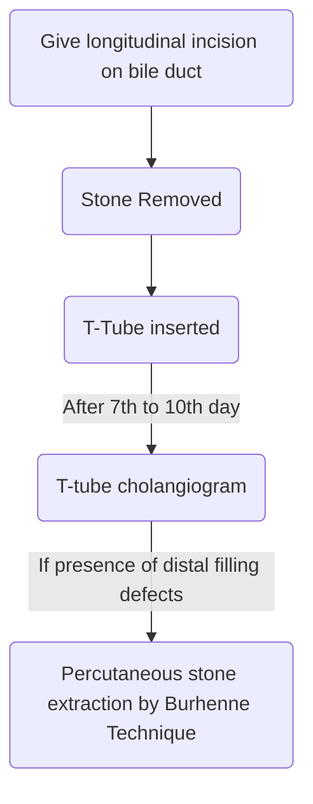

# Bile Duct
## Anatomy
- Common Hepatic Duct
	- Length →  1-4cm
	- Diameter →  4mm
- Common bile duct
	- Length → 1 - 4 cm
	- Diameter → 5-10mm
- Blood supply
	- Has coaxial blood supply
		- Blood supply is present at 3o' clock and 9o' clock position
		- Hence longitudinal incision is given in bile duct
	- Supraduaodenal bile duct gets blood supply from:
		- Inferior (60%)
			- Pancreatic duodenal artery
			- Retro duodenal artery
		- Superior (38%)
			- Right hepatic artery
			- Cystic duct artery
- Sphincter of Oddi complex
	1. Superior choledochal sphincter
	2. Inferior choldocal sphncter
	3. Sphincter ampulaae
	4. Sphincter pancreaticus
	![[SphincterofOddi.jpg]]
## Choledochal Cyst
### General
- Dilatation of bile duct
- Congenital
- MC in Children
### Pathophysiology
- Most accepted hypothesis - **APBDJ** (Abnormal pancreatico biliary duct junction)
	- Has long common channel
	- Reflux of pancreatic enzyme
	- Digestion of bile duct wall
	- Wall dilation
### Classification
- Todani Modification of Alonso-lej Classification

| Type | Description                                                              |
| :--- | ------------------------------------------------------------------------ |
| Ia   | Cystic dilation of extra hepatic bile duct (MC)                          |
| Ib   | Focal segmental dilatation of extra hepatic bile duct                    |
| Ic   | Fusiform dilatation of extra hepatic bile duct                           |
| II   | Diverticular dilatation of extrahepatic bile duct                        |
| III  | Dilatation of intraduodenal part of bile duct (Choledococele)            |
| IVa  | Dilatation of both intra and extra hepatic bile ducts                    |
| IVb  | Multiple cysts involving only extra hepatic bile duct                    |
| V    | Multiple cysts involving only intra hepatic bile duct (Caroli's disease) |
![[CholedochalCyst.jpg]]
- Type I - MC in 
	- Choledochal cyst
	- Hiatus hernia
	- Gastric ulcer
	- Fistula in Ano
	- Posterior urthral valve
- MC type of choledochal cyct → Type I > IV > III
- Type IV - cystic dilatation of cystic duct (not part of Todani classification)
### Treatment
- Type IVA and V → Liver transplantation
- Type I, II, IVb → Roux-en-Y Hepatico-jejunostomy
- Type III → Endoscopic sphincterotomy with cyst unroofing
### Clinical Features
- Mass + Pain + Jaundice (Intermittent jaundice)
- MC symptom in < 2 years of age → Jaundice
- MC symptom in > 2 years of age → Abdominal pain
- MC site of cholangiocarcinoma - Posterior wall of cyst
- Increased risk of organ malignancies
	- Liver
	- Gall Bladder
	- Bile Duct
	- Pancreas
	- Duodenum
### Investigation
- IOC - [MRCP](Misc#MRCP) (Magnetic Resonance Cholangiography)
- ERCP (Endoscopic Retrograde)
	- Diagnostic + Therapeutic
	- Side viewing endoscope used
	- After reaching ampullae using endoscope
		- Bile duct and pancreatic ducts are cannulated
		- Dye injected to detect stone or stenosis
	- Used to
		- Remove stone from <b><u>distal</b></u> part of bile duct
		- Put stent for <b><u>distal</u></b> biliary stricture
- PTC (Percutaneous Transhepatic Cholangiography)
	- Diagnostic + Therapeutic
	- Used to
		- Remove stone from <b><u>proximal</b></u> part of bile duct, intrahepatic bile
		- Locate stent for <b><u>proximal</b></u> biliary strictures
## Choledocolithiasis
### General
- Present in 6-12% patients of gall stones
- Types
	- Retained CBD stones
		- Detected within 2 years of cholecystectomy
	- Recurrent CBD stones
		- Detected after 2 years of cholecystectomy

| Primary stones                                                   | Secondary stones            |
| :--------------------------------------------------------------- | :-------------------------- |
| Formed inside CBD                                                | Formed in Gall Bladder      |
| MC stone - Brown                                                 | Slips into CBD              |
| MC in developing countries                                       | MC type - Cholesterol stone |
| Worm infestations<ul><li>_Ascaris_<li>_Clonorchis sinensis_</ul> | MC in western countries     |
### Lab Parameters
- ALP $\uparrow$ 
- GGT $\uparrow$
- 5-nucleotidase $\uparrow$
### Clinical Features
- Two types of presentation
	- Asymptomatic
		- Asymptomatic elevation of [[#Lab Parameters]]
	- Jaundice with or withot complications
### Complications
- Increased risk of infections
- Increased risk of pancreatitis
- Increased risk of cholangiocarcinoma
### Investigation
- Gold Standard - ERCP
- IOC - MRCP
### Treatment
- ERCP + Stone removal
	- Maximum size of stone removed - 1.5cm
- Stone > 1.5cm - Choledocotomy
- When distal obstruction is suspected - Choledochoduodenostomy
## Cholangitis
### General
- Mandatory principles
	- Obstruction
	- Infection
- Predisposing factors
	- Choledocholithiasis (MC)
	- Biliary stricture
	- Choledochal cyst
	- Cholangiocarcinoma
	- Worms
### Pathophysiology
- MC organism : _E. coli_ > _Klebsiella_
- Normal CBD pressure : 10 - 12cm of H2O
- When obstruction occurs → CBD pressure rises
- When CBD pressure > 25cm of H2O two reflexes occur
	- Cholangiovenous
	- Cholangiolymphatic
### Clinical Features
- **Charcot's Traid** : pain + Jaundice + Fever
- Reynold's Pentad (if delayed t/t) : Charcot's triad + Shock + Mental status changes
- >50% pts. have +ve blood culture
- MC symptom of of sepsis in cholangitis is Chills
### Management
- Two Large bore IV canula
- Start IV fluids + IV antibiotics
- If no improvement: ERCP with stone extraction/stenting
- If not available/failed : PTC with stone extraction/stenting
- If PTC not available/failed: Open biliary decompression
#### Open Biliary Decompression

## Autoimmune Disorders
### General
- Autoantiody - Anti-mitochondrial antibody
- MC in females

### Pathology
- Progressive destruction of intrahepatic bile ducts only
- Diagnostic appearance
	- Florid duct lesion with lymphocytic infiltration and granulomatous inflammation
- Associated with
	- Hyperlipidemia
	- Xanthoma, Xanthelasma
	- Melanosis
### Clinical Features
- Pruritis precedes jaundice
- Pruritis and fatigue - Characterisitic symptoms
- Pruritis - most bothersome in evening
### Diagnosis
- Anti-mitochondrial Ab - Can confirm diagnosis
- IOC - Biopsy
### Treatment
- Liver transplantation 
	- Severe pruritis and fatigue are indications