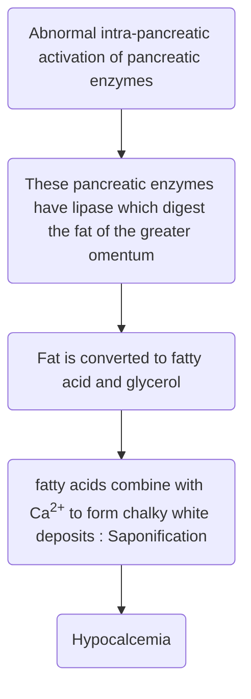

# Pancreas

## Pancreatic Divisum
### General
- MC congenital anomaly of pancreas
- Characterised by divided drainage
	- From dorsal bud
		- Part of head
		- Body and tail
	- From ventral bud
		- Part of head
		- Uncinate process
	![[PancreaticDivisumEmbryo.jpg]]
### Clinical Features
- Recurrent attacks of Acute pancreatitis (Because of relative obstruction)
### Investigation
- IOC - MRCP
- Gold standard - ERCP
### Treatment
- Endoscopic Schincterotomy
	- Dorsal duct sphincterotomy
	- Dorsal duct sphincteroplasty
## Annular Pancreas
![[AnnularPancreas.jpg]]
### General
- Ring of venrtal pancreas present around 2nd part of Duodenum
- Located primal to ampulla
- Associated with Downs Syndrome and Duodenal Atresia
### Clinical Features
- Non-bilious vomiting
	- Obstruction is proximal to ampulla
### Investigation
- IOC - ERCP
### Management
- TOC Duodeno-duodenostomy > Doudenojejunostomy

## Duodenal Atresia
### General
- MC cause of neonatal intestinal obstruction
- Located distal to ampulla
- Have <u><b>bilious vomiting</b></u>.

### Investigations
- On Xray - [Double Bubble appearance](Misc#Bubble%20Xrays)
### Management
- TOC Duodeno-duodenostomy > Doudenojejunostomy

## Acute Pancreatitis
### Causes
- MC cause - Gall Stones > Alcohol
- Other causes
	- Blunt Trauma
	- ERCP
	- Hypertriglyceridemia
	- Hyperparathyroidism
	- Hypercalcemia
	- Ca Pancreas
	- Cystic Fibrosis
- Viral Infections
	- Cytomegalovirus
	- Coxsackievirus
	- Mumps
	- Echovirus
- Drugs having deinite association with Acute Pancreatitis
	- 6-Mercaptopurine
	- Azathiorpine
	- Deoxyinosine
	- Cytarabine
	- Amino salicylic acid
	- Tetracycline
	- Pentamide
	- Estrogen
	- Trimethoprim
	- Sulphamehoxazole
	- Thiazide
	- Valproate
	- Furosemide
	- Metronidazole
- Drugs having possible association
	- L - Asparaaginase
	- Acetaminophen
### Pathophysiology

### General
- It is mild and self limited in majoriy of cases
- Mild AP < 1% mortality
- Severer AP : 10-30% mortality
- <u><b>Gall stone induced pancreatitis has the best prognosis</b></u>
- MC cause of death in Acute Pancreatitis
	- Within 2 weeks of hospitalization - MODS (Multi Organ Dysfunction Syndrome)
		- Initial sign of MODS - Impaired Lung Function (ARDS)
	- After 2 weeks of hospitalization - Sepsis

### Clinical Feautures
- Pain in Epigastrium, radiating to left side of back and partially releived by sitting or bending forward
- Due to Paralytic Ileus - there is Nausea, vomiting and abdominal distension
	- Sign of Paralytic ileus on Xray
		- Gassless Abdomen
		- Ground glass appearance
		- Sentinel loop sign
		- Colon cut off sign
		![[ParalyticIleusXray.jpg]]
- It is associaetd with lef sided pleural effusion
- Signs in Acute pancreatitis with ecchymosis
	- Cullen sign - ecchymosis around umblicus
	- Grey turner sign - ecchymosis around flank
	- Fox sign - ecchymosis around inguinal region
	![[EcchymoticSignsAcutePancreatitis.jpg]]
### Diagnosis
- IOC : CECT
	- Reserved for complications
	- Best time - After 72 hrs
- Diagnosis is usually made with clinical findings and laboratory investigations
	- Amylase (not very specific)
		- Raised in non-pancreatic causes
		- No correlation between level of amylase and severity
	- Lipase
		- More specific
	
### Management
- Fluid resusctitation - Fluid of choice is **Ringer Lactate**
- O2 supplementation
- Analgesics
	- NSAIDS → Metamizole
	- OPIOIDS → Buprenorphine
- Nutrition: Enteral nutrition > TPN
- Indication of TPN
	- Shock
	- Sever Acute Pancreatitis
- Prophylactic antibiotics should not be used
### Assessment of Severity in Acute Pancreatitis
#### Scores
1. Ranson's Score
	- Score > 3 in severe acute pancreatitis
2. Modified Galsgow Score
	- Score > 3 in severe acute pancreatitis
3. BISAP score
	- Score > 3 in severe acute pancreatitis
4. Q-SOFA
5. APACE-II
	- Score >= 8 in severe acute pancreatitis
6. CT severity index
	- Components are
		- Balthazar CT grading
		- Necrosis score
7. CRP > 130 mg/mL
#### Ranson's Prognostic Criteria (For non-gall stone induced pancreatitis)
##### Features
 - At the time of admission 
	 - Age > 55yrs
	 - WBC count > 16000/mm3  
	 - RBS > 200 mg/dL                   
	 - LDH > 350 IU/L                    
	 - AST > 250                     
- After 48 hours
	- Fall in Hematocrit > 10pts
	- BUN elevation > 5mg/dL
	- S. Ca2+ < 8 mg/dL
	- Base deficit > 4 mEq/L
	- Arterial PO2 < 60 mm Hg
	- Fluid Sequesteration > 6L
##### Interpretation
- Out of 11 if >= 3 present - "Severe Acute Pancreatitis"
- Minimum time for complete Evaluation - 48hrs

#### BISAP Score (Bed side Index for Severity of Acute Pancreatitis)
##### Features
- B - BUN > 25mg/dL
- I - Impaired Mental Status
- S - SIRS (2 of 4)
	- Temperature(core) > 38oC or < 36oC
	- Heart Rate > 90 beats/min
	- Respiratory Rate > 20 breaths/min
	- WBC count
		- > 12000 cells/mm3 or
		- < 4000 cells/mm3 or
		- > 10% immature (band) cells in peripheral smear
- A - Age > 60yrs
- P - Pleural Effusion
##### Interpretation
- If score 3 - Severe acute pancreatitis
- If score is 0-2 - <2% mortality
- If score is 3-5 - >15% mortality

#### Q-SOFA (Quick Sequential Organ Failure Assessment)
##### Features
- Respiratory Rate > 22/min
- Systolic BP <= 100mmHg
- Alteration in Mental Status
##### Interpretation
| Score | Mortality |
| ----- | --------- |
| 0     | < 1%      |
| 1     | 2-3%      |
| >= 2  | >= 10%    |
#### APACHE-II (Acute Physiology and Chronic Health Evaluation - II)
##### Features
1. BP
2. Temp
3. HR
4. RR
5. S. Creatinine
6. WBC Count
7. Glasgow Coma Scale
8. Sodium
9. Hematocrit
10. Oxygenation
11. pH
12. Potassium
##### Interpretation
- Score >= 8 is suggestive of Severe Acute Pancreatitis

### Local Complications of Acute Pancreatitis according to <u>Revised Atlanta Classification</u>

- Acute < 4 weeks
	- No defined wall
	- Complicated to Acute Pancreatic fluid collection
	- Resolves spontaneously
	- Some cases after 4 weeks develops into pancreatic pseudocyst
- Chronic > 4 weeks
	- Pseudocyst
	- Walled of necrosis
- Pancreatic Abscess
	- Pus collection in peripancreatic region
	- Treatment
		- USG/CT guided percutaneous aspiration
		- Antibiotics
- Pancreatic necrosis
	- Non-viable pancreatic tissue or peripancreatic fat
	- It is a sterile condition
	- MC complication is infection
	- MC organism responsible in _E. coli_
	- Drugs with good pancreatic penetration power are Carbapenems
		- Imipenem
		- Meropenem
	- Management
		- Repeated necrostomy
		- Surgical debridement with ongoing lavage
- Pancreatic Pseudocyst
	- MC ystic lesion of pancreas
	- It is a false cyst (Lined with granulation tissue)
	- MC cause of pseudocyst - Alcohol
	- MC site - Lesser sac
	- Pseudocyst can be seen in both Acute and Chronic Pancreatitis
		- In Acute Pancreatitis
			- Single
			- Large
			- Extra-pancreatic
			- Incidence - 10 - 12%
		- In Chronic Pancreatitis
			- Multiple
			- Small
			- Intra-pancreatic
			- 20 - 40%
	- Clinical Features
		- In most patients pseudocyst is small hence asymptomatic
		- In symptomatic patients
			- MC symptom - Abdominal pain
			- Vomiting (Non bilious) containing undigested food partiles
	- Complications
		- MC is infection (14%) > Hemorrhage (10%)
	- Diagnosis
		- IOC - CECT
	- Treatment
		- Observation - Most resolve spontaneously
		- Indications for surgery
			- Duration > 6 weeks
			- Size >= 6cm
		- Surgery
			- Cysto-jejunostomy - TOC (Best Results)
				![[Cystojejunostomy.jpg]]
				- Advantages
					- Drainage along gravity
					- No formation of SUMP syndrome
				- Disadvantages
					- Increased duration of surgery
					- Increased bloo loss
			- Cysto-gastrostomy - MC performed
				![[Cystogastrostomy.jpg]]
				- Disadvantages
					- Drainage against gravity
					- Since the drainage is against gravity, food may enter pseudocyst and cause infection (bacterial overgrowth) leading to SUMP
			- Cysto-duodenostomy
## Chronic Pancreatitis
### General
- Characterised by irreversible fibrosis of pancreatic parenchyma with ongoing inflammation
	- Exocrine insuffiency
		- It precedes endocrine insufficiency
		- > 90% acini permanantly destroyed
		- Leads to
			- Indigestion
			- Malabsorption
			- Steatorrhea
	- Endocrine insuffiency
		- > 90% of islet cells permanently destroyed
		- Leads to DM
	- Chronic pain
- Causes
	- MC cause - Heavy alcohol consumption
		- Smoking has synergestic effect
### Clinical Features
- MC symptom is Abdominal pain
- Characterized by triad
	- **D**iabetes Mellitus
	- **P**ancreatic Calcification
		- Calcifications present in 30% to 40% cases
	- **S**teatorrhoea
### TIGARO Classification of Etiology
- **T** - Toxic - Metabolic
- **I** - Idiopathic
- **G** - Genetic
- **A** - Autoimmune
- **R** - Recurrent severe acute pancreatitis
- **O** - Obstructive
### Diagnosis
- IOC - MRCP
- Gold standard - ERCP
- On ERCP
	- Shows alternate stricture and dilation of pancreatic duct with pancreatic stones enclosing giving <b><u>String of pearls/Chain of lakes/Beaded</b></u> appearance
		![[ChainofLakes_chronicPancreatitis.jpg]]
	- Composition of stone - **Ca(CO3)2
- Endoscopic USG - Most accurate investigation for diagnosis of minimal change in chronic panreatitis
- <b><u>ROSEMENT criteria</b></u> is based on endoscopic USG findings
![[PancreaticCalcifications.jpg]]
### Management
- Exocrine insufficiency - Enteric coated pancreatic enzyme supplementation
- Endocrine insufficiency - Insulin
- Pain - Analgesics
	- NSAIDS - Metamizole
	- Opioids - Buprenorphine
- If Pain not relieved with analgesics: ERCP stenting/oblique stone removal
- Pain not relieved with ERCP and stenting: Celiac Ganglion blockade
- Pain not relieved with Celiac Ganglion Blockade: Surgery
### Surgery
- Drainage Procedure
	- Puestow's procedure
		- Also called LPJ (Longitudinal Pancreaticojejunostomy)
		- Opening pancreatic duct and suture with jejunum
- Resection Procedure
	- Berger's Procedure
		- Also called DPPHR - Duodenal preserving pancreatic head resection
		- After shaving the pancreatic head, suture the body with jejunum
		- Has maximum pain relief
	- Frey's Procedure
		- Also called LRLPJ - Local resection of Pancreatic head with Longitudinal pancreatic jejunostomy