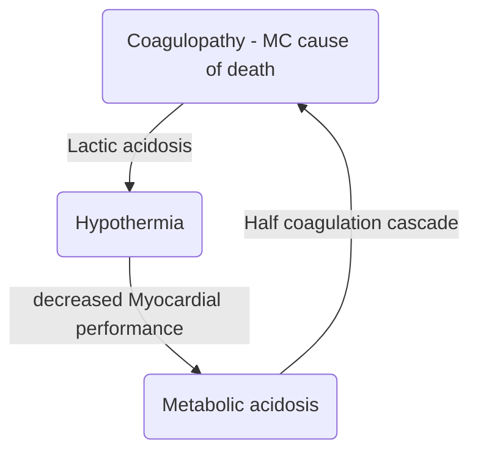

# Abdominal Trauma

## General
- MC injured organ in Blunt Trauma Abdomen (BTA) - Spleen > Liver
- MC injured organ in penetrating trauma - Liver > Stomach > Small Intestine
- MC injured part of bowel in BTA - Jejunum
- MC injured organ in gunshot injury - Small Intestine
- MC site of injury in deceleration injury - Duodenojejunal junction
- 1st investigation done in patient of BTA - FAST
- Gold standard investigation for stable pt of BTA - CECT
## FAST (Focussed Assessment with Sonography for Trauma)
- It is an emergency USG and performed very fast (in 2-4 minutes)
- Assess potential sites for thoracoabdominal injuries (4Ps)
	- Pericardial sac
	- Perihepatic region
	- Perislenic region
	- Pelvis
- 4 traditional views in FAST
	- Subxiphoid transverse view
	- LUQ longitudinal view
	- RUQ longitudinal view
	- Suprapubic transverse and logitudianl view
	
### e-FAST (extended FAST)
- Has two additional views (total 6)
	- Right thoracic view
	- Left thoracic view
- Pneumothorax on e-FAST shows <u>Bar code sign/Stratosphere sign</u>

## Diagnostic Peritoneal Lavage

- Performed in BTA patients
	- Catheter is inserted after infra-umblical incision and directed towards pelvis
	- Aspiration is done
	- Instill NS/RL for lavage
	- Reaspiration of fluid is done
- DPL is considered +ve if
	- 10mL of frank blood is aspirated
	- Returned effluent contains
		- RBCs  $\rightarrow$ > 1Lakh/mm3
		- WBC  $\rightarrow$ > 500/mm3 
	- Presence of bile, bacterial, fecal matter, vegetable matter
	- Amylsae > 175 IU/dL
## Blunt Abdominal Trauma Protocol

## Penetrating Trauma
- MC injured organ - Liver > Stomach > Small Intestine
- Exploratory laprotomy is mandatory - Gunshot Wound
		

## Organ specific
### Splenic Trauma
#### General
- MC organ damaged in BTA
- Kehr's sign
	- Pain is referred to tip of left shoulder in splenic rupture
	- Due to irritaation of undersurface of diaphragm with blood 
	- Pain is referred to shoulder via phrenic nerve  $\rightarrow$ C4 C5.
- Ballance sign
	- Fixed area of percussible dullness in LUQ due to coagulation of blood
#### AAST Grading of splenic trauma (American Association for Surgery of Trauma)

| Grade | Hematoma                                             | Laceration                              |
| :---: | ---------------------------------------------------- | --------------------------------------- |
|   I   | Subcapsular hematoma involving < 10% surface area    | Capsular tear > 1cm in depth            |
|  II   | Subcapsular hematoma involving 10 - 50% surface area | Capsular tear 1-3cm in depth            |
|  III  | Subcapsular hematoma involving > 50% surface area    | > 3cm tear involving Trabecular vessels |
|  IV   | > 25% devascularization                              | Laceration involving hilar vessels      |
|   V   | Completely shattered spleen                          | Complete devascularization              |
#### Protocol

### Liver Trauma
#### General
- MC injured organ in penetrating trauma
- 2nd MC injured organ in BTA
- Most Liver injuries involve [segment VI, VII, VIII](Surgery/PancreatoBiliary/Liver/CouinaudSegments)
- Bleeding - mainly venous  $\rightarrow$ low pressure tamponade is readily performed
- 4Ps in Liver injury
	- Push
	- Plug
	- Pringle
	- Pack
- Bear claw laceration - Multiple linear lacerations of liver on CECT
#### Pringle's Maneuver

- Total inflow Occlusion
- Non traumatic clamping in foramen of Winslow and we occlude the portal triad
- It controls bleeding from portal vein and hepatic artery
- Bleeding is effectively controlled from Portal Vein as compared to Hepatic Artery
- Doesn't control bleeding from Portal vein and IVC
#### AAST grading of liver Trauma
| Grade | Hematoma                                           | Laceration                                           |
| :---: | :--------------------------------------------------: | :----------------------------------------------------: |
|   I   | Subcapsular hematoma involving < 10% surface area  | Capsular tear < 1cm in depth                         |
|  II   | Subcapsular hematoma involving 10-50% surface area | Capsular tear 1 - 3cm in depth                       |
|  III  | Subcapsular hematoma involving > 50% surface area  | Capsular tear > 5cm in depth                         |
|  IV   | -                                                  | Parenchymal disruption involving 25-75% hepatic lobe |
|   V   | -                                                  | Parenchymal disruption involving > 75% hepatic lobe  |
|  VI   | Hepatic avulsion                                   | -                                                    |
#### Protocol

### Duodenal Trauma
#### General
- A/w pancreatic injuries
- IOC for Dx of duodenal trauma - CECT
- On radiology - Gas or fluid in Retroperitoneum with leakage of oral contrast
- Injury of <u>1st , 3rd or 4th part</u> - repaired <u>like small bowel</u> with sutures
- Injury of <u>2nd part</u> - <u>Damage Control Surgery</u> (Triple tube ostomy)
- Triple tube ostomy
	- Decompressive Gastrostomy
	- Decompresive Duodenostomy
	- Feeding Jejunostomy
	
### Pancreatic Trauma
#### General
- In adult - MC cause  $\rightarrow$  Penetrating
- In children - MC cause  $\rightarrow$ Blunt trauma
	- Handlebar  $\rightarrow$ Bicycle
	- MC affected  $\rightarrow$ body of pancreas
#### AAST grading of pancreatic trauma
| Grade | Hematoma                            | Laceration                                                  |
| :---: | :-----------------------------------: | :-----------------------------------------------------------: |
|   I   | Minor contusion without duct injury | Superficial laceration without duct injury                  |
|  II   | Major contusion without duct injury | Major laceration without duct injury                        |
|  III  | -                                   | Distal transection or parenchymal injury with duct injury   |
|  IV   | -                                   | Proximal transection or prenchymal injury involving Ampulla |
|   V   | -                                   | Massive disruption of pancreatic head                       |
#### Diagnosis
- IOC - CECT
- ERCP - Most reliable test to demonstrate pancreatic duct integrity
#### Management
- Grade I
	- Observation
- Grade II
	- Debridement
	- Drainage
	- Possible repair
- Grade III
	- Distal resection, Roux-en-Y drainage
- Grade IV and V
	- Damage Control surgery
	- Resection + Roux-en-Y drainage
	- Triple tube decompression
	- Pyloric exclusion
	- Duodenal diverticularization
	- Pancreatico Duodenectomy
- MC complication
	- Pancreatic fistula
	- Persistent drain output

## Seat Belt Injury
- Seat belt syndrome - unique injury profile associated with use of seat belt
- MC injured structure - **Mesentry**
- Classical seat belt sign 
	- Skin abreasion on
		- Neck
		- Chest
		- Abdomen
	- Associated with
		- High chances of internal organ injury
		- PacreaticoDuodenal injuries

## Trauma Triad of Death

## Damage Control Surgery
### General
- Done to blunt the physiological resonse to prolonged shock and hemorrhage
	- Abbreviated laprotomy
	- Temporary packing
	- Closure of abdomen
	- At limits of phyiological reserve
- Long duration of surgery may cause ecaberation of
	- Hypothermia
	- Coagulopathy
	- Metabolic acidosis
### Phases
- Phase I
	- Initial exploration
	- For rapid control of hemorrhage + contamination
		- Packing 4 quadrants
		- For perforation  $\rightarrow$ Suture closure
	- Segmented stapled resection
- Phase II
	- Shift patient to ICU
	- For 2o resustitaion
		- 48hrs
		- Correct
			- Hypothermia
			- Coagulopathy
			- Metabolic acidosis
- Phase III
	- Planned re-exploration
	- Definitive repair of injuries
### Stages
| Stage | Description                                     |
| :---: | ----------------------------------------------- |
|   I   | Patient selection                               |
|  II   | Operative control of herrhage and contamination |
|  III  | ICU resustitation                               |
|  IV   | Definitive surgery                              |
|   V   | Abdominal closure                               |

## Abdominal Compartment Syndrome (ACS)
### General
- ACS - $\uparrow$ IAP(>20mmHg) - results in compression of abdominal structures
- Causes fatal complications
	- Pulmonary failure
	- Mesenteric vascular compromise
- Normal IAP  $\rightarrow$ 5-7mmHg
- Intra abdominal HTN  $\rightarrow$ ≥ 12 mmHg
- Predominantly occurs in
	- Patients of profound shock
	- Patients requiring large amount of fluid or blood for resustitation
	- Major visceral or vascular abdominal injuries
### Clinical Features
- Sudden increase in IAP
- $\uparrow$ peak inspiratory pressure
- Hypoxia, hypercapnia, hypotension
- $\downarrow$ venous return to heart
- $\downarrow$ urine output
### Diagnosis
- Measure Bladder pressure as it represents IAP
- Gold standard indirect method to measure IAP
	- Unrinary bladder catheter
### Management
| Grade | Bladder Pressure | C/F                                                                   | Rx                         |
| :---: | ---------------- | --------------------------------------------------------------------- | -------------------------- |
|   I   | 12-15 mmHg       | None                                                                  | Normovolemic resustitation |
|  II   | 16-20 mmHg       | Oliguria, Splanchnic Hypoperfusion                                    | Hypovolemic resustitation  |
|  III  | 21-25 mmHg       | Anuria, $\uparrow$ Ventilation pressure                               | Decompression              |
|  IV   | > 25 mmHg        | Anuria, $\uparrow$ Ventilation pressure + $\downarrow$ PO2 | Emergency Re-exploration   |

## Retro-peritoneal Injuries
### Zones

#### Zone I - Central
- Extends from esophageal hiatus to sacral promontory
- Hemorrhage or hematoma - usually located in midline
- A/w injuries of
	- Aorta and its proximal branches
	- IVC and its proximal tributaries
- Divided into
	- Supra mesocolic Zone 1
		- Supra renal aorta
		- IVD
		- Superior mesenteric vessels
		- Proximal renal vessels
	- Infra mesocolic Zone 1
		- Infra renal aorta and its bifurcation
		- IVC
- Management
	- Central hematoma  $\rightarrow$ Exploration with proximal and distal vascular control
#### Zone II - Lateral
- Extends from lateral diaphragm to iliac crest
- Structures located - Distal renal vessels
- Management
	- Lateral hematoma (Renal in origin)  $\rightarrow$ Managed non-operatively **(Angioembolization)**
#### Zone III - Pelvic
- Confined to retroperitoneal zone of pelvis
- Structures contained - Iliac vessels
- Management
	- Pelvic hematoma  $\rightarrow$ 
		- Exceptionally difficult to control
		- Usually should not be opened
		- Packing/Angio-embolization
#### Zone IV - Portal and Retrohepatic areas
- Lesser sac

## Renal Trauma
### General
- MC injured part of urinary tract - Kidney
- MC cause of renal trauma - RTA
- Best predictor of traumatic urinary system injury - Hematuria
### Diagnosis
- IOC for Dx in stable patient - CECT
- IOC for Dx in unstable patient - **single shot IVP** (Assess function of C/L kidney)
### Grading

- Grade I
	- Microscopic/gross hematuria with normal urological studies
	- Subcapsular, non-expanding hematoma without parenchymal laceration
		- Microscopic hematuria > 3RBCs/HPF
- Grade II
	- Non expanding peri-renal hematoma
	- Laceration < 1cm in depth without urinary extravasation
- Grade III
	- Laceration > 1cm in depth of renal cortex
- Grade IV
	- Parenchymal laceration through collecting system
	- Main renal artery or vein injury with contained hematoma
- Grade V
	- Completely shattered kidney
	- Avulsion of renal hilum  $\rightarrow$ Devascularization of kidney
### Management
- > 95% cases  $\rightarrow$ Conservative (low grade injury)
- < 5% cases  $\rightarrow$ Operative intervention
- Indications of Renal exploration
	- Absolute
		- Persistent renal bleeding
		- Expanding or pulsatile peri-renal hematoma
	- Relative
		- Urinary Extravasation
		- Non-viable tissue
		- Segmental arterial injuries
- Indications of Nephrectomy
	- Unstable pt  $\rightarrow$ Hypothermia/Coagulopathy with normal contralateral kidney
	- Extensive renal injury
	- Poor functioning hydronephrotic kidney