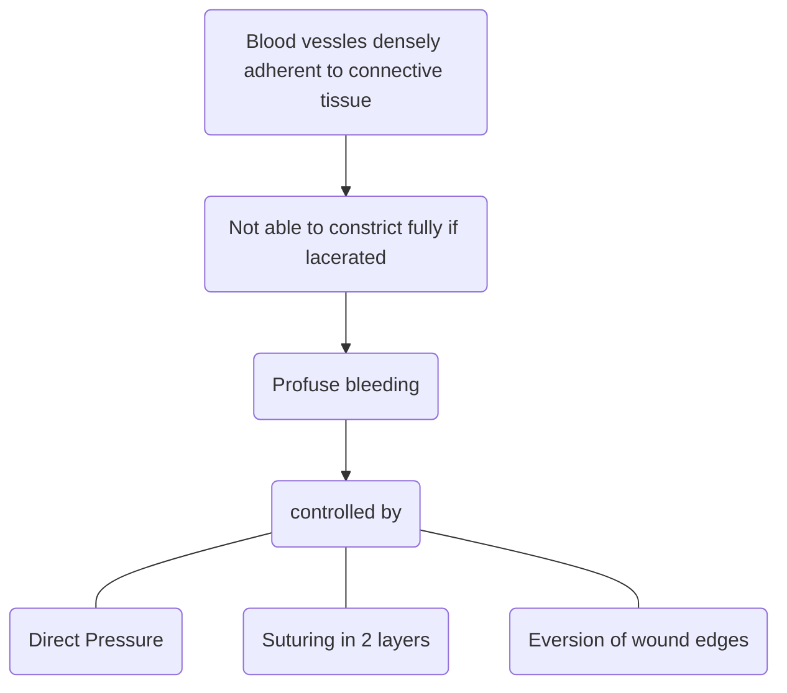

# Head Injury

## Layers of Scalp
- **S**kin
- **C**onnective Tissue
- **A**poneurosis
- **L**oose areolar tissue
- **P**eriosteum
	
### Skin
- Has numerus hair follicles
- MC site of sebaceous cyst
### Connective tissue
- Rich innervations
- Rich vascularity
- Emissary veins present in Loose Areolar connective tissue

## Skull Fracture
### Closed fracture
- Covered by intact skin
- No specific treatment required
### Open or compound fracture
#### General
- Associated with disrupted overlying skin
- Treatment
	- Repair of scalp and operative debridement
- Indications of craniotomy
	- Depression greater than cranial thickness
	- Intracranial hematoma
	- Frontal sinus involvement
#### Depressed skull fractures
	
- Inner and outer cortex - disrupted
- Fragment of bone is pressed towards the brain
- Inner cortex of bone frag. can have multiple sharp ends - Can lead to laceration of
	- Dura
	- Brain
	- Vessels
- Treatment
	- Craniotomy
		- To elevate fracture
		- To repair dural disruption
		- To obtain hemostasis
## Skull base fracture
### Types

#### Anterior cranial fossa fracture
##### General
- MC type of skull base fracture
- Incidence - 70%
- Site of fracture - <u>Cribriform plate</u>
##### Clinical features
- Subconjunctival Hematoma
- Gold standard confirmatory test - Detection of CSF-$\beta$ 2 Transferrin assay
- Epistaxis
- Anosmia
- CSF Rhinorrhea
	- Presence of Target/Hal sign (Double ring sign)
		
	- Frontal lobe contusion
	- Periorbital Hematoma - **Racoon eyes or Black eyes**
#### Middle cranial fossa Fracture
##### General
- Fracture of Petrous part of temporal bone $\rightarrow$ Dural laceration
- Incidence - 20-25%
##### Clinical Features
- CSF otrrhoea - Occurs only if tympanic membrane is perforated
- Paradoxical Rhinorrhoea
	- CSF leaks through nose if tympanic membrane intact
	- Also known as otorhinorrhoea
	- Collection of blood behind tympanic membrane - Hemotympanum
- Battle sign - Echhymosis or bruising over mastoid process
- 7th and 8th cranial nerve injury 
- Temporal lobe contusion
	
#### Posterior Cranial Fossa Fracture
##### General
- Fracture of occipital bone
- Incidence 5%
##### Clinical Features
- Contusion of occipital bone
- Visual disturbances
- VIth cranial nerve injury
- Jugular foramen syndrome/Vernet syndrome
	- Paresis of 9th , 10th , 11th  cranial nerves
- Basilar artery injury

## NICE guidelines (National Institute for Health and Care Excellence)
### NICE guidelines for frequency of neurological observation in head injury patients
- Half hourly basis until GCS = 15
- Minimum frequency of observations for pt. with GCS equal to 15 should be
	- First 2 hours - every half hour
	- Next 4 hours - Every hour
	- After 6 hours - Every 2 hours
### NICE guidelines for indications of CT in Head Injury patients
- Indications of CT within 1st hour
	- GCS < 13 at any point
	- GCS < 15 at 2 hours
	- FND (Focal neurological deficiet)
	- Suspected open, depressed or basal skull fracture
	- 1 episode of vomiting
- Post traumatic seizure
- Indications of CT within 8 hours
	- Age > 65 years
	- Coagulopathy 
		- Aspirin
		- Warfari
		- Rivaroxaban
	- Dangerous mechanism of injury
		- Fall
		- RTA
	- Retrograde amnesia > 30mins
## Brain Injury
### Types
#### Primary
- Neural damage attributed to traumatic insult itself
- Includes
	- Shearing of axonal neorons
	- Contusion or Laceration of cerebral tissues
	- Diffuse axonal injuries
#### Secondary
- Occurs after some time
- Preventable causes
	- Hypoxia
	- Hypotension
	- $\uparrow$ ICT
	- $\downarrow$ CPP
	- Pyrexia
### Concussion
- Temporary neuronal dysfunction following non-penetrating trauma
- NCCT - normal
- Deficits resolve over minutes to hours
### Contusion
- Cerebral contusion results from being damaged by
	- Impacting against skull at the point of impact <u>(coup)</u>
	- On the opposite side of impact <u>(counter coup)</u>
- Most commonly affects **Inferior frontal lobe & temporal lobe**
- IOC - NCCT head
- Treatment
	- Conservative management (generally)
	- Surgery (rarely required)
		- Delayed surgical intervention to reduce the mass effect

## Meninges
### General
- 3 layers
	- Dura mater
	- Arachnoid mater
	- Pia mater
	

### Extradural and Subdural Hematoma
#### Extradural Hematoma
##### General
- Blood collects between skull and dura (peeled off)
- Doesn't cross suture line
- MC site - Temporal bone
	- Pterion - thinnest part of skull
	- Trivial trauma
- Caused by injury to middle meningeal artery
- Lucid interval positive
##### Investigation
- IOC - NCCT head
- In NCCT - Shows biconvex or lenticula hyperdense lesion
	
##### Treatment
- Drainage by 
	- Burrhole
	- Craniotomy
#### Subdural Hemorrhage
##### General
- Blood collection between dura and arachnoid (intact)
- Crosses suture line
- Injury to **cortical veins** or **bridging veins**
- Acute SDH $\rightarrow$ < 3 days
- Subacute SDH $\rightarrow$ 4 - 21 days
- Chronic SDH $\rightarrow$ > 21 days
- Elderly
- Caused by significant trauma
- Impaired consciousness
##### Investigations
- IOC - NCCT head
- In NCCT
	- Concavo convex hyperdense lesion
	
##### Treatment
- Drainage by 
	- Burrhole
	- Craniotomy

#### Burr Hole
- On the side of hematoma close to pterion
- At pterion convergence of
	- Frontal
	- Parietal
	- Temporal
	- If CT not available - create burrhole on the side where patient has **dilated pupil**
### Subarachnoid Hemorrhage
#### General
- MC cause - Trauma > spontaneous rupture of Berry aneurysm
#### Clinical Features
- Sudden transient loss of consciousness
- Excruciating severe headache (Worst headache)
- Neck stiffness and vomiting
- FND - Uncommon
- Hallmarks of SAH caused by aneurysm rupture
	- Sudden headache in abscence of FND
	- Xanthomorphic spinal fluid
#### Investigation
- IOC for diagnosis - NCCT head
#### Management
- Conservative

## Diffuse Axonal Injury (DAI)
### General
- Wide spread axonal damage involving both hemispheres after severe head injury
- Results from application of shearing force leading to axonal injury
	- Acceleration
	- Deceleration
	- Angular strain to the brain
- MC site - Lobar white matter > Corpus callosum > Brain stem
### Clinical Features
- Loss of conscioussness
- MC cause of <u>post traumatic vegetative state</u>
- ICT can be normal or raised
### Investigation
- NCCT head - Normal
- IOC - MRI
### Prognosis
- Extremely poor

## Raised ICT
### Pathophysiology
- Brain depends on continuous perfusion for O2 and glucose supply
- Normal cerebral blood flow - 55mL/min for every 100gm of brain tissue
- Cerebral blood flow depends on cerebral perfusion pressure
- Cerebral perfusion pressure - MAP - Intracranial Pressure
	- Normal CPP is 75 - 105 mmHg
	- Normal MAP is 90 - 110 mmHg
	- Normal ICP is 5 - 15 mmHg
- If ICP $\uparrow$ - CPP$\downarrow$  $\rightarrow$ leading to ischemia
- Uncontroled $\uparrow$ in ICP leads to
	- Cerebral herniation
	- Cerebellar tonsilar herniation through Foramen Magnum
		- Compresses medullary vasomotr and respiratory centers
		- Causes <u>Cushing's Triad</u>
			- Hypertension
			- Bradycardia
			- Irregular respiration
### Active Management of $\uparrow$ ICT
1. Elevate head end of bed to 30o (reverse T/B position)
2. Drain CSF - Ventriculostomy
3. Osmotherapy - Mannitol
4. Glucocorticoids - Dexamethason
	- Avoid in
		- Head Injury
		- Ischemic Stroke
		- Hemorrhagic stroke
5. Sedation
	- Morphine
	- Propofol
	- Midazolam
	- N/M paralysis
6. Hyperventilation - ET intubate (only for short period of time)
7. ICP monitoring
#### Goals
- ICP < 22 mmHg
- CPP ≥ 60mmHg
- In case ICP > 20-25 mmHg for 5 min Active Management
- Second tier therapies - For refractory elevated ICP
	- Decompressive craniotomy
	- High dose barbiturate therapy
	- Hypothermia (37o  $\rightarrow$ 33o )